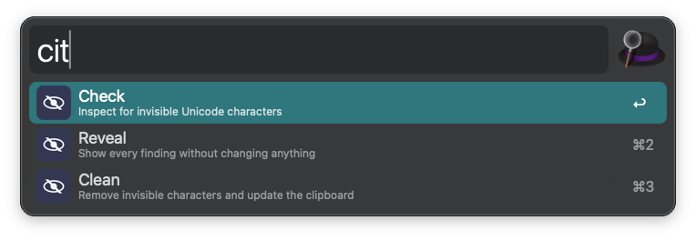
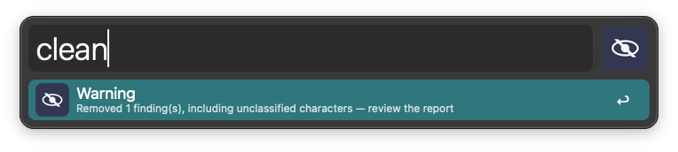
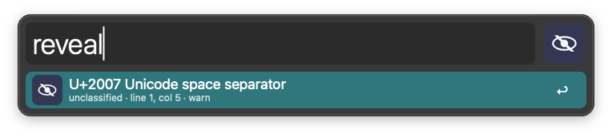
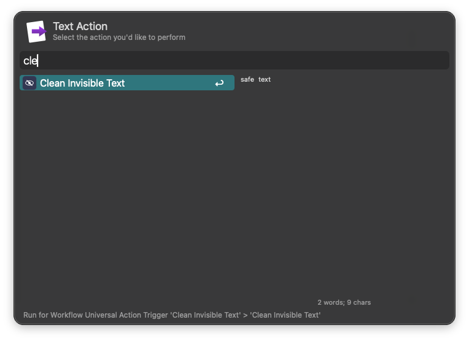

# Clean Invisible Text for Alfred

> **このファイルは正本(日本語版)です。**
> 英語版(参照)は [README.md](README.md) を参照してください。

危険な不可視 Unicode 文字をローカルでレビュー・クリーニングするための Alfred Workflow。

> **Status:** [リリース済み](https://github.com/y-marui/alfred-clean-invisible-text/releases/latest)
> (署名・notarize済み)。Apple Silicon上で両方のエントリーポイントの動作を確認済み
> — 残作業(Intel実機テスト、任意・ベストエフォート)は
> [ロードマップ](https://github.com/y-marui/alfred-clean-invisible-text/issues/1) 参照。

この Workflow は
[go-clean-invisible-text](https://github.com/y-marui/go-clean-invisible-text)
の薄い macOS フロントエンドであり、Unicode クリーニングのルール自体は独自実装しない
([ADR 0001](docs/decisions/0001-separate-cli-and-workflow.md) 参照)。

## Requirements

- Alfred 5 以降
- macOS 13 (Ventura) 以降、Intel または Apple Silicon — 固定しているCLI自体の
  下限に合わせている。詳細は [ADR 0003](docs/decisions/0003-v1-compatibility-and-upgrade-policy.md) 参照

## Setup

署名済みの[最新リリース](https://github.com/y-marui/alfred-clean-invisible-text/releases/latest)の
`.alfredworkflow` をダウンロードし、ダブルクリックしてAlfredに読み込む。
他に設定は不要 — どちらのエントリーポイントもそのまま動作する。
(ソースからのビルドはコントリビューター向けの手順。[DEVELOPING.md](DEVELOPING.md)参照。)

## Usage

`cit` キーワードで、クリップボードのテキストに含まれる不可視Unicode文字を
検査・除去する。

Universal Actionで、選択中のテキストに含まれる不可視Unicode文字を検査・除去する。

どちらのエントリーポイントも同じ選択肢に辿り着く([docs/specification.md](docs/specification.md)
に完全な相互作用モデル・状態・アクセシビリティに関する記述がある):

* Check — テキストを検査し、findingsの有無を1行で要約表示する
* Reveal — 変更を書き込まずに、すべてのfinding(コードポイント・名前・カテゴリ・位置)を表示する

  
* Clean — CLIのクリーナーを実行し、成功後にクリップボードのプレーンテキストを置き換える

  

Check/Reveal/Clean の結果行では:

* <kbd>↩︎</kbd> findingsのレポートをコピーする(元のテキストは除外)
* <kbd>⌘</kbd><kbd>↩︎</kbd> 元のテキストを含むレポートをコピーする
* <kbd>⇧</kbd><kbd>↩︎</kbd> 未分類の文字を除去せず保持したまま Clean を再実行する(Warning状態の場合のみ)

## Documentation

- [docs/specification.md](docs/specification.md) — Alfred Workflow の仕様
- [docs/dependency-policy.md](docs/dependency-policy.md) — CLIの固定・検証方法
- [docs/release-process.md](docs/release-process.md) — Workflowリリースの作成・公開手順
- [docs/alfred-gallery-readiness.md](docs/alfred-gallery-readiness.md) — Alfred Gallery掲載チェックリスト
- [docs/decisions/](docs/decisions/) — アーキテクチャ決定記録 (ADR)

## Contributing

[CONTRIBUTING.md](CONTRIBUTING.md) を参照。

## License

[MIT](LICENSE)

---
*この文書には英語版 [README.md](README.md) があります。編集時は同一コミットで更新してください。*
